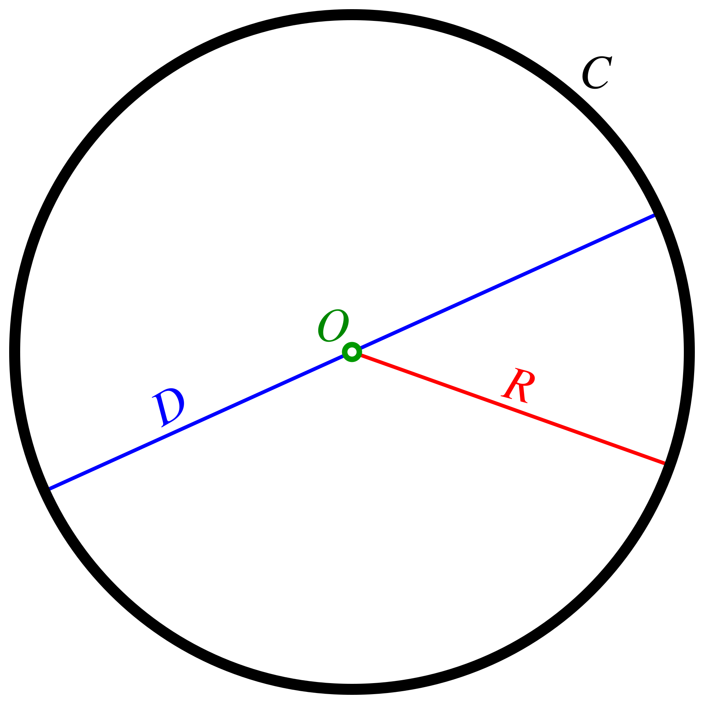

# Геометрические фигуры
## Оглавление
1. [Окружность](#круг)
2. [Квадрат](#квадрат)
### Круг

[Ссылка на вики](https://ru.wikipedia.org/wiki/Окружность)
- Площадь: $S = \pi r^2$
- Периметр: $P = 2\pi r = \pi d$

Example: `area(5) = 78,5`

[Ссылка на фото](https://ru.wikipedia.org/wiki/Окружность#/media/Файл:Circle-withsegments.svg)

### Квадрат

[Ссылка на вики](https://ru.wikipedia.org/wiki/Квадрат)
- Площадь: $S = a * a$
- Периметр: $P = 4 * a$

Example: `area(5) = 25`

[Ссылка на фото](https://ru.wiktionary.org/wiki/квадрат#/media/Файл:Kvadrato.svg)

* 517683d (HEAD -> documentation) add_information_to circle_and_square
* 1432e66 (main) add_new_file
* d078c8d (origin/main, origin/HEAD) L-03: Docs added
* 8ba9aeb L-03: Circle and square added